# LAPORAN PRAKTIKUM PEMROGRAMAN BERBASIS OBJEK

| Informasi Praktikan | Keterangan |
| :--- | :--- |
| **Nama** | Arkan Abdul Hafizh |
| **NPM** | 4525210137 |
| **Kelas** | A |
| **Mata Kuliah** | Pemrograman Berbasis Objek (PBO) |
| **Pertemuan** | 2 - Kelas, Objek, dan Enkapsulasi |
| **Tanggal** | 10 - 09 - 2026 |

---

## 1. Implementasi Java

### 1.1. File: `Mahasiswa.java`
**Penjelasan Kode:**
> Kelas `Mahasiswa` merepresentasikan data mahasiswa pada sistem akademik, yaitu NIM, nama, dan tiga komponen nilai (tugas, UTS, UAS). Atribut `nim` dan `nama` dideklarasikan `private final` sehingga tidak bisa diubah setelah objek dibuat, sedangkan `nilaiTugas`, `nilaiUts`, dan `nilaiUas` bersifat `private` agar tidak bisa diakses langsung dari luar kelas (enkapsulasi). Bobot nilai disimpan sebagai konstanta `BOBOT_TUGAS` (0.30), `BOBOT_UTS` (0.30), dan `BOBOT_UAS` (0.40), serta batas nilai pada `NILAI_MIN` dan `NILAI_MAX`, sehingga tidak ada angka yang ditulis langsung di dalam method.
>
> Constructor memvalidasi data sebelum objek terbentuk. NIM tidak boleh `null` atau kosong, dan setiap nilai harus berada pada rentang 0 sampai 100 lewat method private `pastikanNilaiSah()`. Jika melanggar, constructor melempar `IllegalArgumentException`, sehingga objek yang tidak valid tidak pernah ada (menjaga invariant). Method `nilaiAkhir()` menghitung nilai akhir dengan bobot 30% tugas, 30% UTS, dan 40% UAS, lalu `hurufMutu()` mengonversinya menjadi huruf A sampai E. Akses data dilakukan lewat getter `getNim()`, `getNama()`, dan `getNilaiAkhir()`, dan `toString()` dioverride untuk menampilkan data dalam satu baris.

**Bukti Eksekusi (Screenshot):**
* **Before** *(Kondisi awal / Kesalahan kompilasi)*:

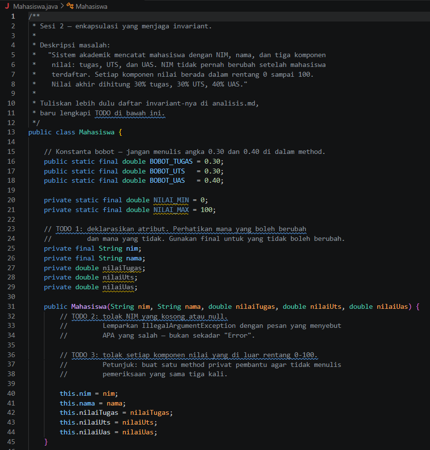
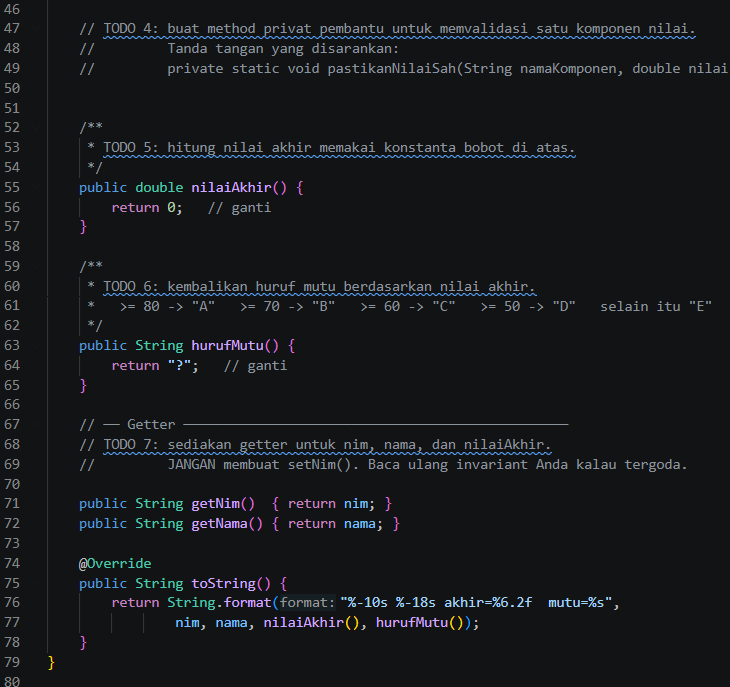

* **After** *(Kondisi akhir / Eksekusi berhasil)*:

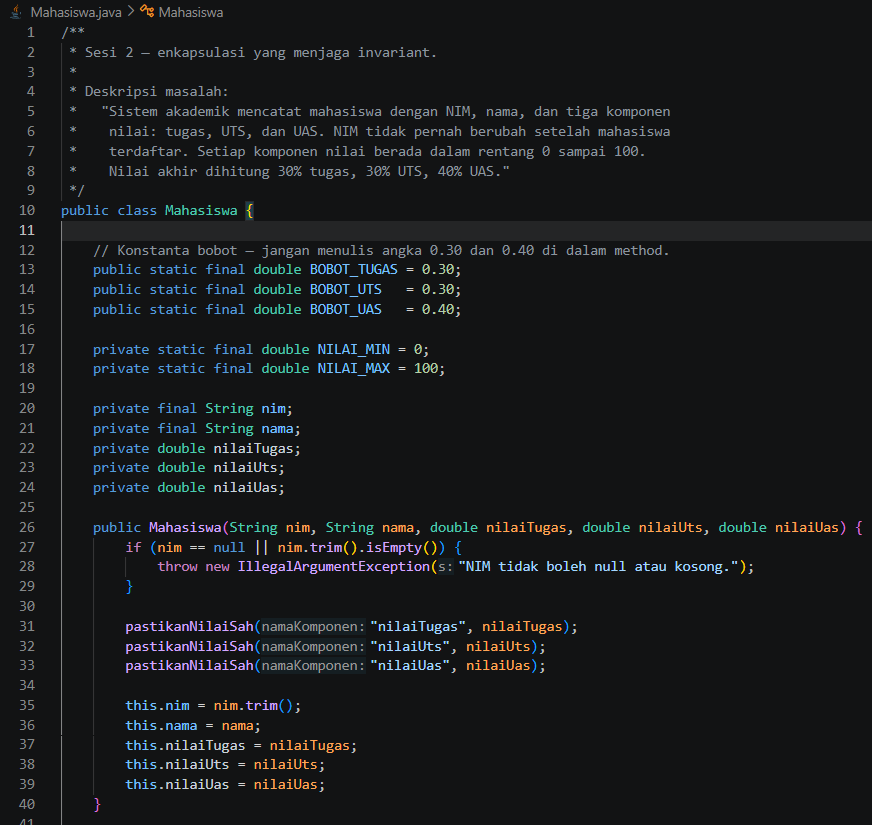
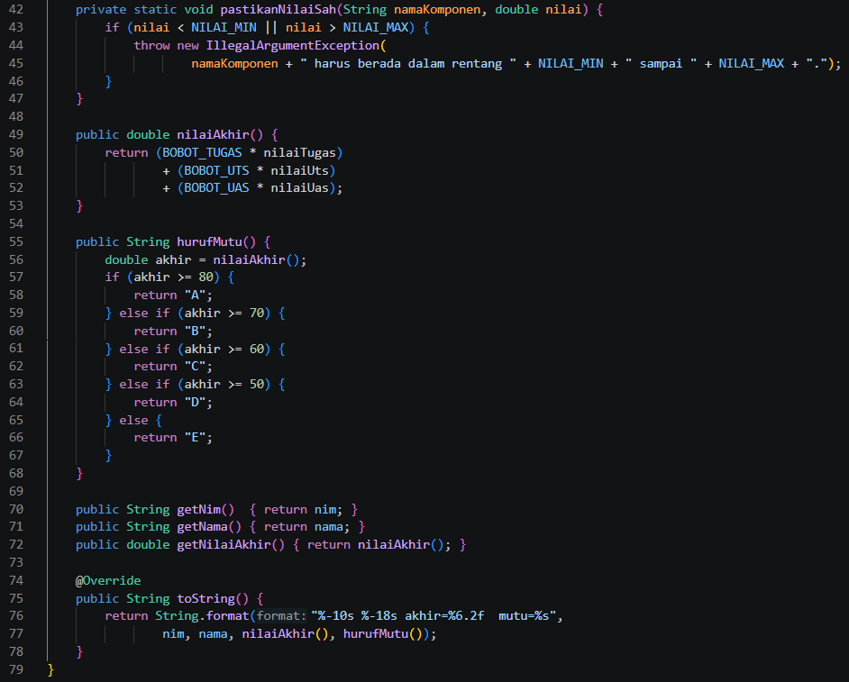

### 1.2. File: `Main.java`
**Penjelasan Kode:**
> Kelas `Main` adalah program uji yang berisi method `main()` sebagai titik awal eksekusi. Pertama, program membuat array berisi tiga objek `Mahasiswa` dengan kata kunci `new` beserta nilai awalnya, lalu mencetak rekap nilai tiap objek menggunakan `toString()`. Kedua, program menguji validasi dengan mencoba membuat objek yang melanggar aturan, yaitu nilai tugas 150 dan NIM kosong, di dalam blok `try-catch`. Karena constructor `Mahasiswa` melempar `IllegalArgumentException`, kedua percobaan ditolak dan pesan kesalahannya ditampilkan lewat `getMessage()`. Hasil ini membuktikan bahwa enkapsulasi pada kelas `Mahasiswa` berjalan dengan benar.

**Bukti Eksekusi (Screenshot):**
* **Before** *(Kondisi awal / Kesalahan kompilasi)*:

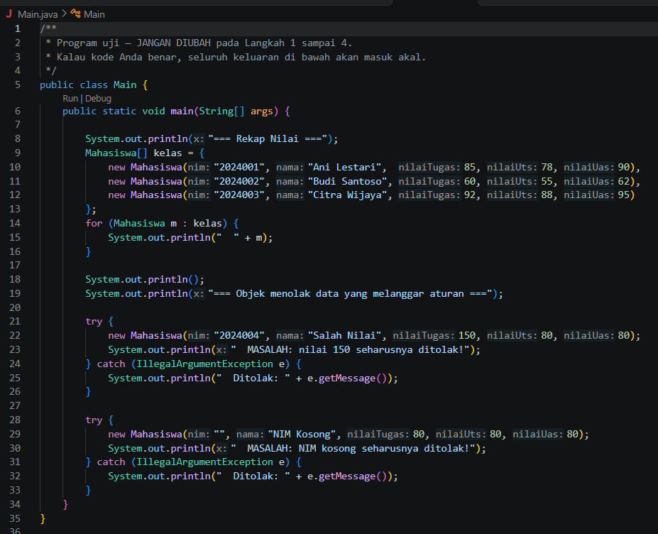

* **After** *(Kondisi akhir / Eksekusi berhasil)*:

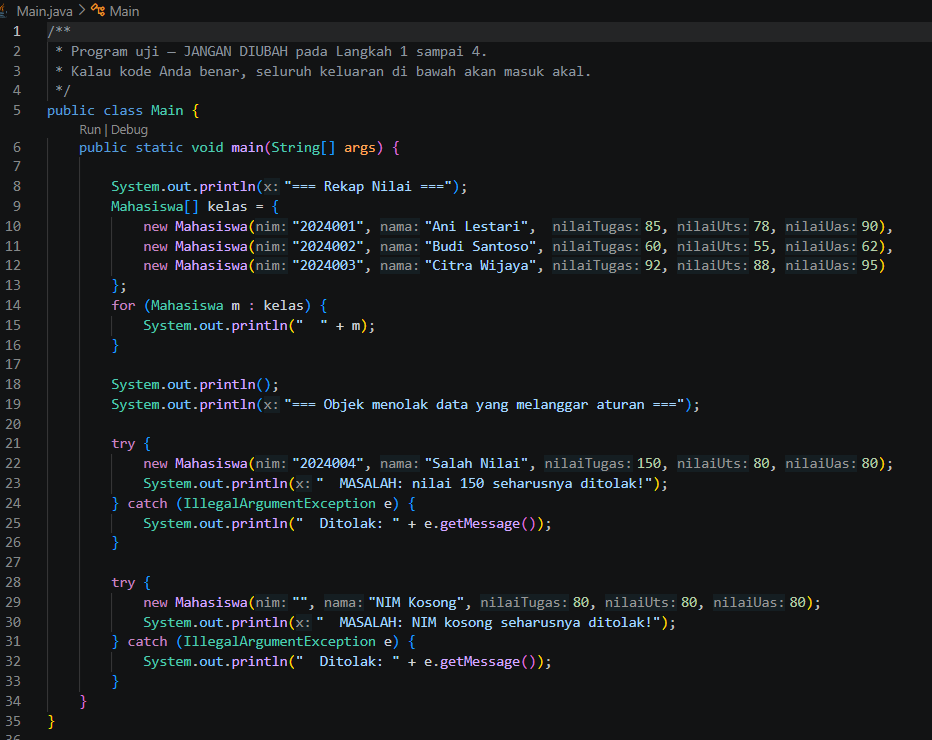

Hasil eksekusi program:

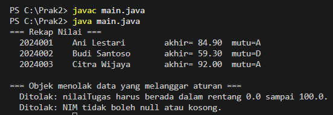

---

## 2. Implementasi PHP

### 2.1. File: `Mahasiswa.php`
**Penjelasan Kode:**
> Kelas `Mahasiswa` versi PHP memiliki fungsi yang sama dengan versi Java. Atribut `nim` dan `nama` memakai `private readonly` (padanan `final` pada Java), sedangkan nilai tugas, UTS, dan UAS bersifat `private`. Atribut dideklarasikan langsung di parameter constructor lewat constructor property promotion (PHP 8), jadi tidak perlu menulis deklarasi atribut dan penugasan `$this->` secara terpisah. Bobot dan batas nilai disimpan sebagai konstanta kelas (`BOBOT_TUGAS`, `BOBOT_UTS`, `BOBOT_UAS`, `NILAI_MIN`, `NILAI_MAX`) dan diakses dengan `self::`.
>
> Di dalam constructor, NIM divalidasi dengan `trim()` agar tidak kosong, dan nilai divalidasi lewat method private static `pastikanNilaiSah()`. Jika melanggar, dilempar `InvalidArgumentException`. Method `nilaiAkhir()` menghitung nilai dengan bobot yang sama, dan `hurufMutu()` memakai ekspresi `match (true)` untuk menentukan huruf mutu. Akses data lewat getter, dan `__toString()` dipakai agar objek bisa dicetak langsung. Perbedaan sintaks dengan Java: variabel diawali `$`, akses anggota memakai `->`, dan constructor ditulis `__construct()`.

**Bukti Eksekusi (Screenshot):**
* **Before** *(Kondisi awal / Galat logika)*:

*Tidak ada screenshot kondisi awal untuk file ini.*

* **After** *(Kondisi akhir / Eksekusi berhasil)*:

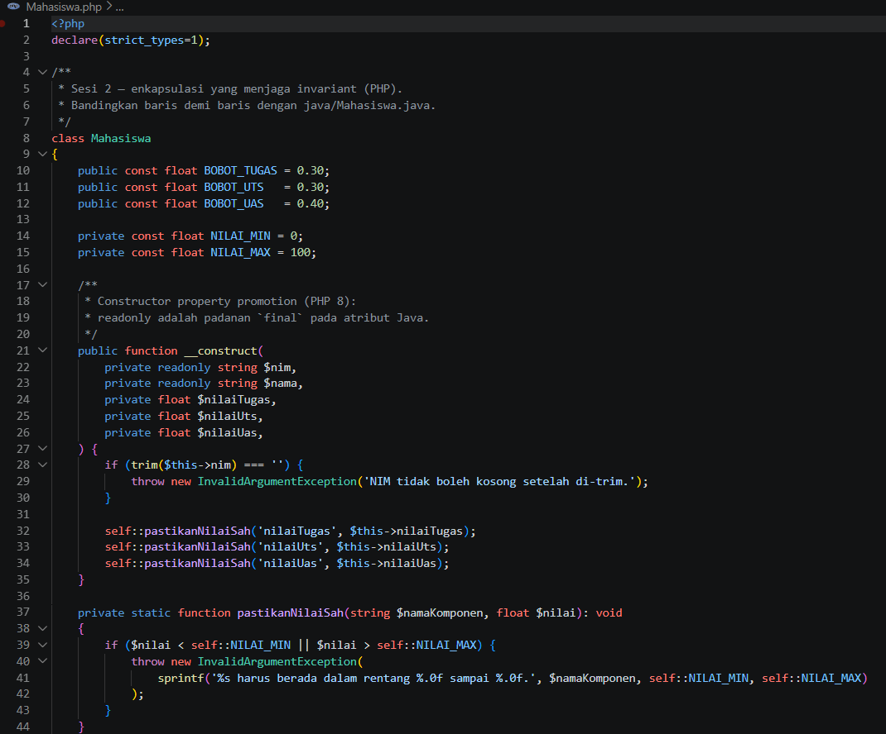
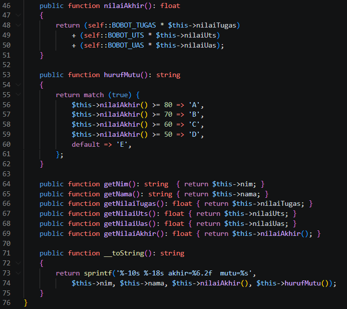

### 2.2. File: `main.php`
**Penjelasan Kode:**
> File `main.php` adalah program uji versi PHP dan menjadi titik awal eksekusi. File ini memuat kelas `Mahasiswa` dengan `require_once`, lalu membuat array berisi tiga objek `Mahasiswa` dan mencetak rekap nilainya dengan `echo` (pemanggilan `__toString()` terjadi otomatis). Setelah itu program menguji validasi dengan membuat objek yang melanggar aturan, yaitu nilai tugas 150 dan NIM kosong, di dalam blok `try-catch`. Kedua percobaan ditolak karena constructor melempar `InvalidArgumentException`, dan pesan kesalahannya ditampilkan lewat `getMessage()`. Keluarannya sama dengan versi Java.

**Bukti Eksekusi (Screenshot):**
* **Before** *(Kondisi awal / Galat logika)*:

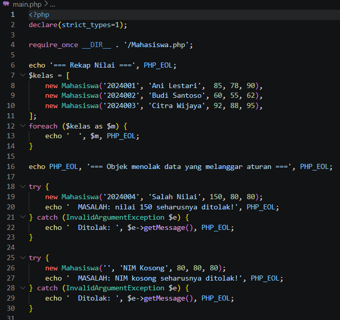

* **After** *(Kondisi akhir / Eksekusi berhasil)*:

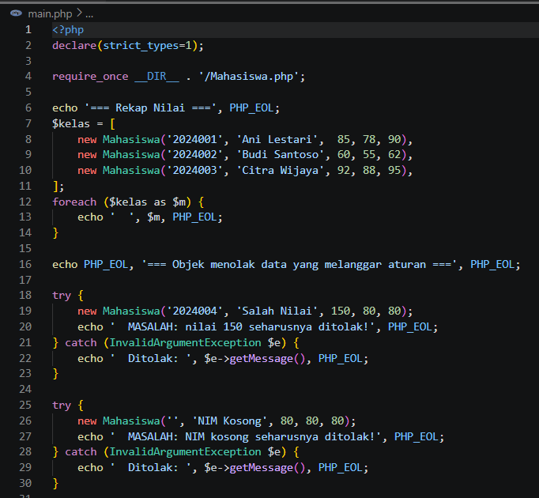

Hasil eksekusi program:

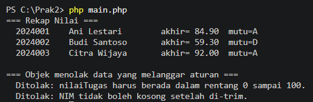

---

## 3. Kesimpulan
> Pada praktikum ini diterapkan konsep kelas, objek, dan enkapsulasi lewat kelas `Mahasiswa` di Java dan PHP. Atribut dibuat `private` (dan `final`/`readonly` untuk data yang tidak boleh berubah), lalu validasi ditempatkan di constructor sehingga objek yang melanggar aturan, seperti nilai di luar 0 sampai 100 atau NIM kosong, ditolak dengan exception. Dengan begitu, data di dalam objek selalu valid. Perbandingan kedua bahasa menunjukkan konsep yang sama dengan sintaks berbeda, misalnya `final` pada Java setara dengan `readonly` pada PHP, dan constructor biasa pada Java setara dengan constructor property promotion pada PHP.