# LAPORAN PRAKTIKUM PEMROGRAMAN BERBASIS OBJEK

| Informasi Praktikan | Keterangan |
| :--- | :--- |
| **Nama** | Arkan Abdul Hafizh |
| **NPM** | 4525210137 |
| **Kelas** | A |
| **Mata Kuliah** | Pemrograman Berbasis Objek (PBO) |
| **Pertemuan** | 3 - Constructor Berdelegasi, Anggota Statis, dan Konstanta |
| **Tanggal** | 17-09-2026 |

---

## 1. Implementasi Java

### 1.1. File: `RekeningBank.java`

**Penjelasan Kode:**

Kelas `RekeningBank` menerapkan tiga konsep utama pertemuan ini:

1. **Constructor berdelegasi**: constructor ringkas `RekeningBank(nomor, pemilik)` memanggil constructor lengkap lewat `this(nomor, pemilik, 0)`, sehingga validasi tidak ditulis dua kali.
2. **Anggota statis**: `jumlahRekening` adalah penghitung milik kelas yang dinaikkan satu kali di constructor lengkap. Karena constructor ringkas mendelegasikan ke constructor lengkap, penghitung tidak naik dua kali. Method statis `getJumlahRekening()` dan `bungaSetahun()` dipanggil lewat nama kelas.
3. **Konstanta**: angka ajaib diganti `BUNGA_TAHUNAN` (0.025), `BIAYA_ADMIN` (5000), dan `BATAS_PENARIKAN_SEKALI` (5.000.000) dengan `public static final`.

Invarian yang dijaga: saldo tidak pernah negatif, nomor rekening tidak berubah (`final`), serta setoran dan penarikan harus bernilai positif. Method `potongBiayaAdmin()` memakai `Math.max(0, ...)` agar saldo tidak menjadi negatif.

**Bukti Eksekusi (Screenshot):**

<table>
  <tr>
    <th align="center">Before (Kondisi awal / Kode masih TODO)</th>
    <th align="center">After (Kondisi akhir / Kode sudah dikerjakan)</th>
  </tr>
  <tr>
    <td>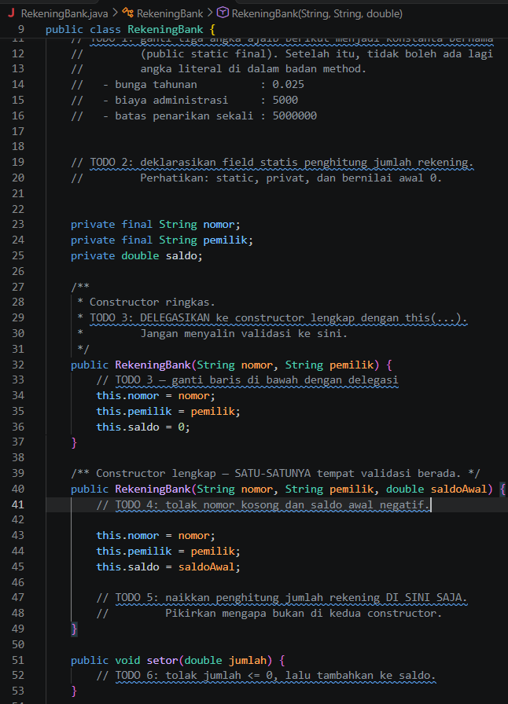</td>
    <td>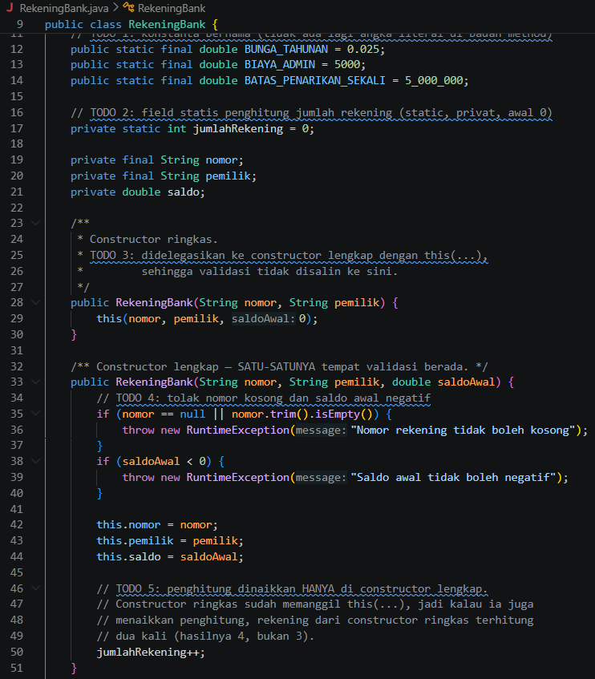</td>
  </tr>
  <tr>
    <td>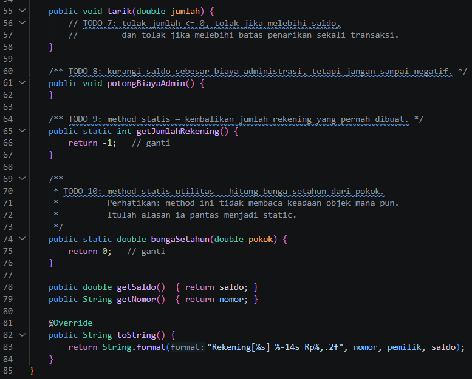</td>
    <td>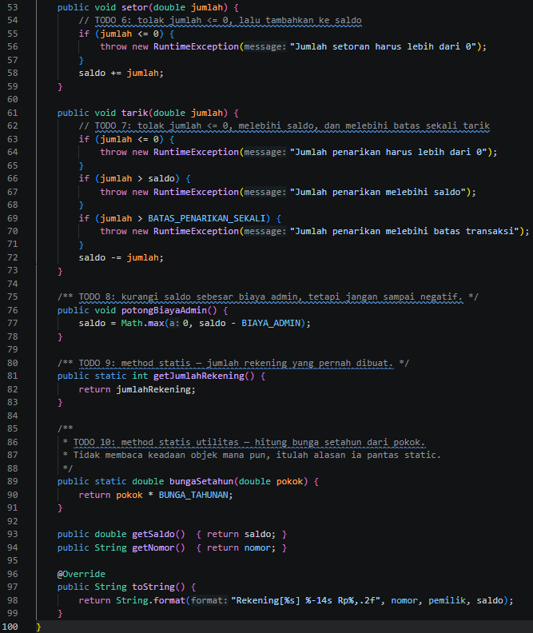</td>
  </tr>
</table>

---

### 1.2. File: `Main.java`

**Penjelasan Kode:**

`Main` adalah program uji untuk `RekeningBank`. Program melakukan hal berikut:

1. Membuat tiga rekening (Ani, Budi, Citra), lalu menampilkan jumlah rekening yang harus bernilai **3, bukan 4**.
2. Menguji setoran 500.000 pada rekening Ani.
3. Menguji penarikan 9.999.999 yang harus **ditolak** dengan exception.
4. Menguji pemotongan biaya admin pada saldo Budi (0) agar saldo tidak negatif.
5. Menghitung bunga setahun lewat method statis `RekeningBank.bungaSetahun()`.

**Bukti Kode (Screenshot):**

  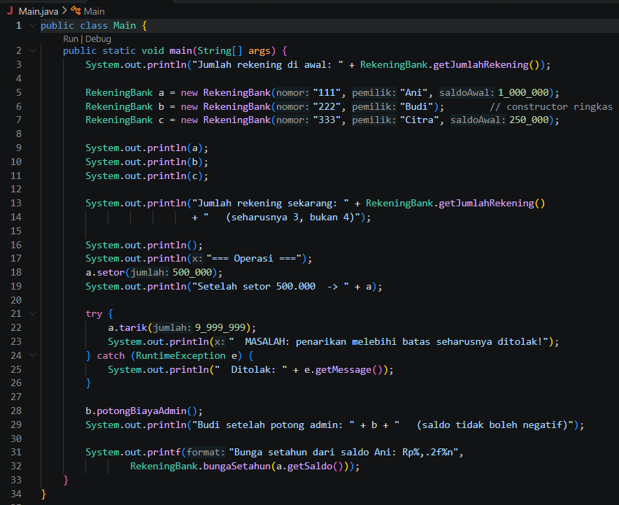

---

## 2. Implementasi PHP

### 2.1. File: `RekeningBank.php`

**Penjelasan Kode:**

PHP tidak mendukung *constructor overloading*, sehingga padanannya dibuat dengan dua cara:

1. **Default parameter**: `float $saldoAwal = 0` pada constructor.
2. **Named constructor**: `rekeningPelajar()` berupa static factory yang membuat rekening dengan saldo awal nol. Method ini memakai `new static()` (bukan `new self()`) agar mendukung *late static binding*.

Konstanta dideklarasikan dengan `const` (bunga tahunan, biaya admin, batas penarikan), dan penghitung rekening memakai properti `private static int`. Properti `nomor` dan `pemilik` bersifat `readonly` agar tidak berubah setelah objek dibuat. Method `setor()`, `tarik()`, dan `potongBiayaAdmin()` menjaga invarian yang sama seperti versi Java.

**Bukti Eksekusi (Screenshot):**

<table>
  <tr>
    <th align="center">Before (Kondisi awal / Kode masih TODO)</th>
    <th align="center">After (Kondisi akhir / Kode sudah dikerjakan)</th>
  </tr>
  <tr>
    <td>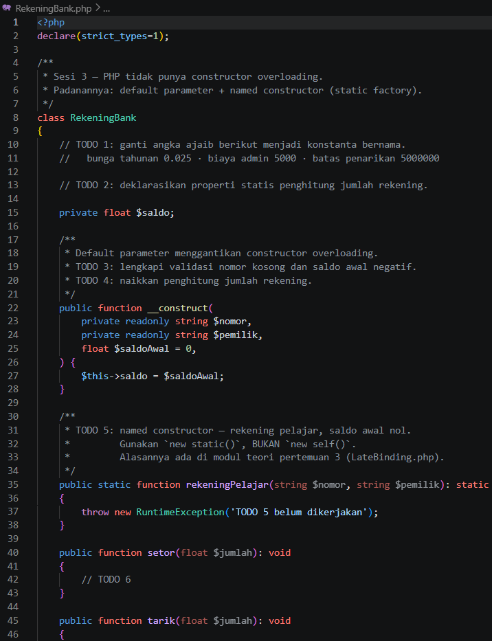</td>
    <td>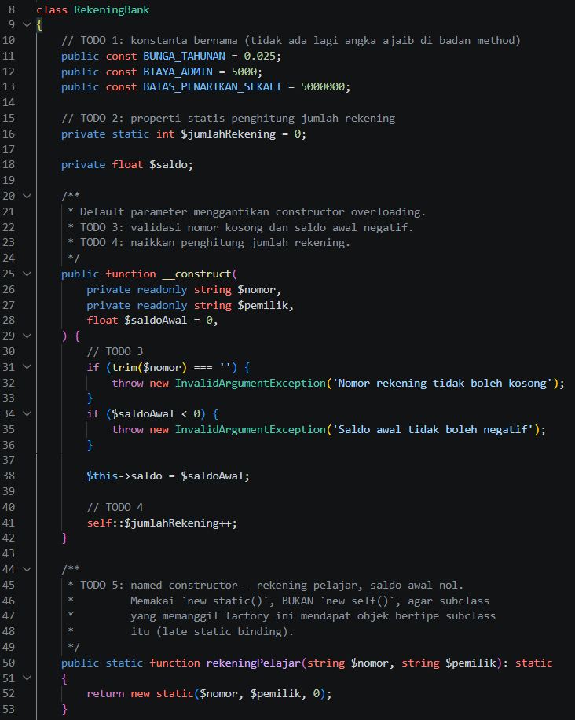</td>
  </tr>
  <tr>
    <td>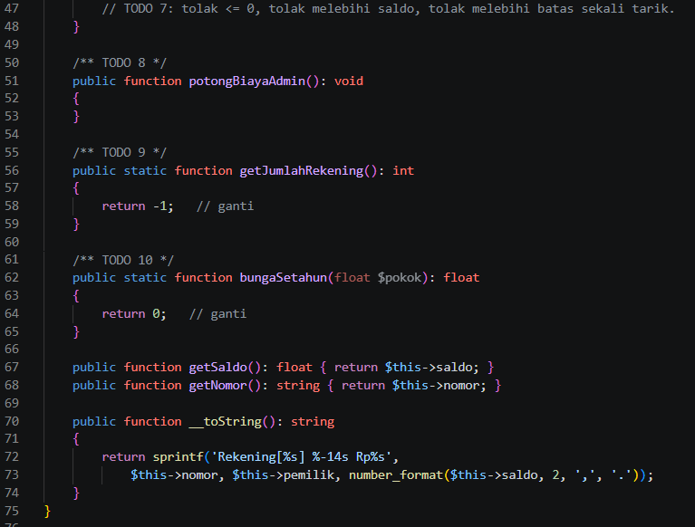</td>
    <td>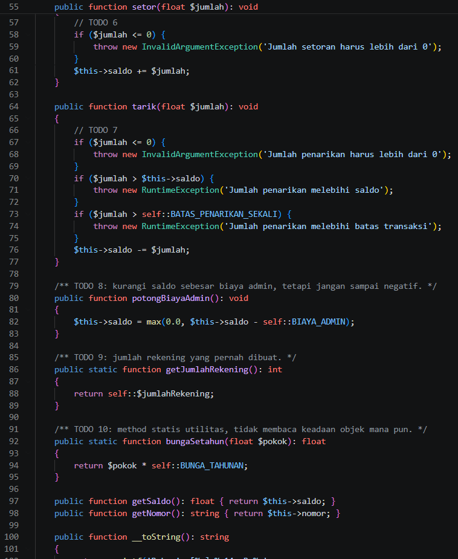</td>
  </tr>
</table>

---

### 2.2. File: `main.php`

**Penjelasan Kode:**

`main.php` memuat `RekeningBank.php`, lalu:

1. Membuat rekening Ani dan Citra lewat `new`, serta Budi lewat named constructor `RekeningBank::rekeningPelajar()`.
2. Menampilkan jumlah rekening (harus 3).
3. Menguji setoran dan penarikan berlebih yang harus ditolak (ditangkap dengan `catch (RuntimeException | InvalidArgumentException $e)`).
4. Menguji potong biaya admin agar saldo tidak negatif.
5. Menghitung bunga setahun dengan method statis. Akses anggota statis memakai operator `::`.

**Bukti Kode (Screenshot):**

  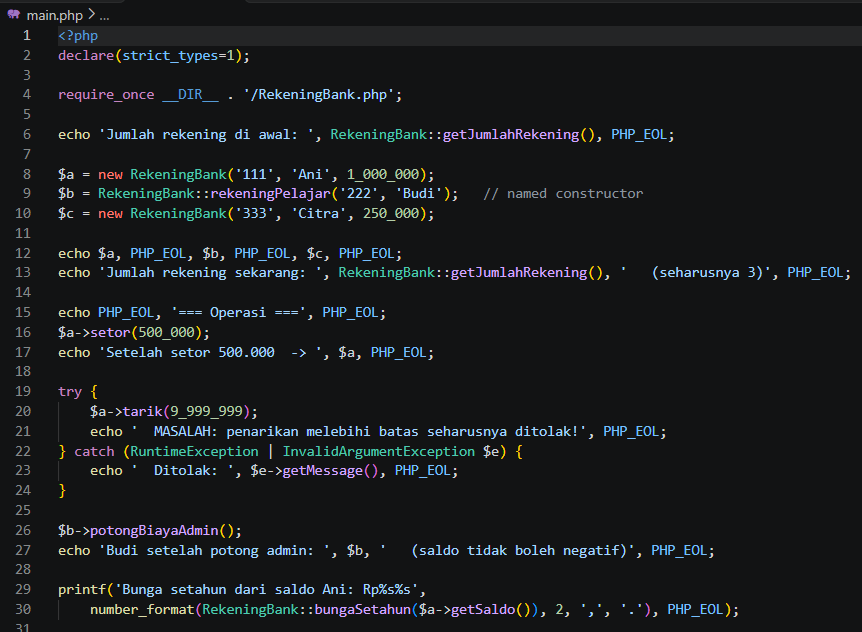

---

## 3. Hasil Eksekusi Program

Berikut hasil menjalankan program secara keseluruhan di terminal.

### 3.1. Java (`java Main`)

  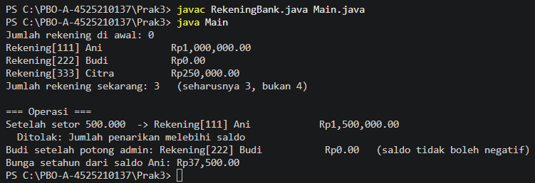

### 3.2. PHP (`php main.php`)

  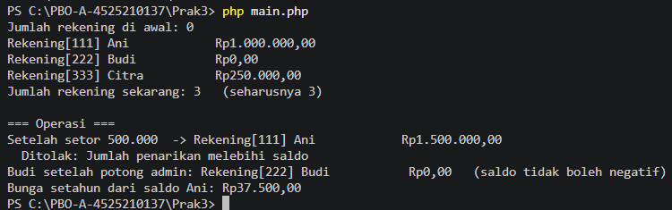

---

## 4. Kesimpulan

Constructor berdelegasi menghindari duplikasi validasi dan membuat penghitung statis akurat (3 rekening, bukan 4). Anggota statis menyimpan data yang dimiliki bersama oleh seluruh objek dan diakses lewat nama kelas. Konstanta bernama menggantikan angka ajaib sehingga kode lebih mudah dibaca dan hanya perlu diubah di satu tempat. Pada Java, overloading constructor didukung langsung, sedangkan pada PHP padanannya adalah default parameter dan named constructor dengan `new static()`.