# LAPORAN PRAKTIKUM PEMROGRAMAN BERBASIS OBJEK

| Informasi Praktikan | Keterangan |
| :--- | :--- |
| **Nama** | Arkan Abdul Hafizh |
| **NPM** | 4525210137 |
| **Kelas** | A |
| **Mata Kuliah** | Pemrograman Berbasis Objek (PBO) |
| **Pertemuan** | 4 - Pewarisan (Inheritance) |
| **Tanggal** | 24-09-2026 |

---

## 1. Implementasi Java

### 1.1. File: `Pegawai.java`
**Penjelasan Kode:**

`Pegawai` adalah kelas induk (superclass) yang menyimpan atribut dan perilaku umum seluruh pegawai. Kelas-kelas turunan mewarisi anggota dari kelas ini dengan kata kunci `extends`.

**Bukti Eksekusi (Screenshot):**

<table>
  <tr>
    <th align="center">Before (Kondisi awal / Kesalahan kompilasi)</th>
    <th align="center">After (Kondisi akhir / Eksekusi berhasil)</th>
  </tr>
  <tr>
    <td>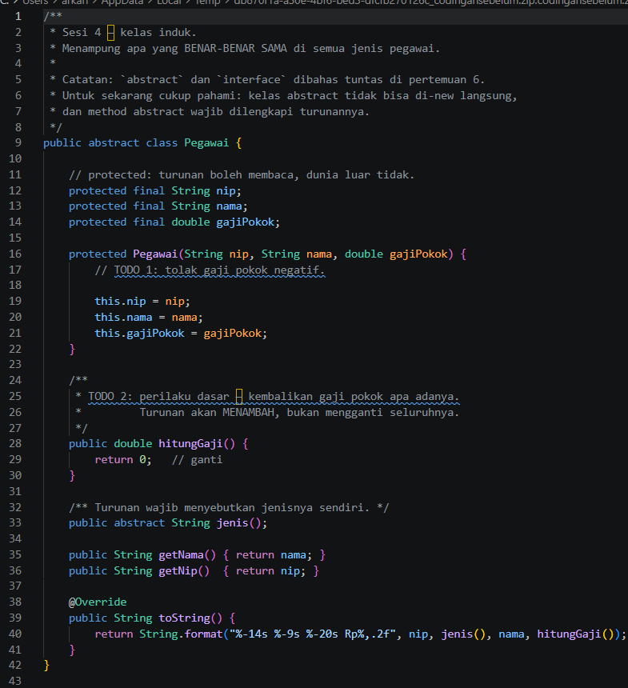</td>
    <td>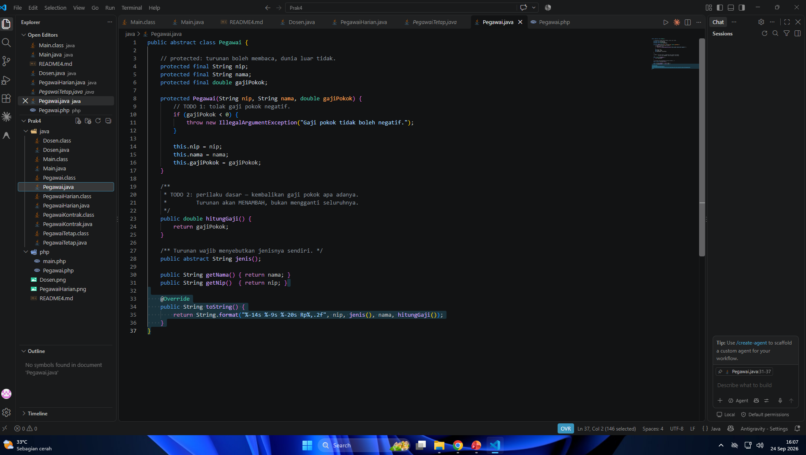</td>
  </tr>
</table>

---

### 1.2. File: `PegawaiTetap.java`
**Penjelasan Kode:**

`PegawaiTetap` adalah kelas turunan dari `Pegawai`. Kelas ini memanggil constructor induk lewat `super(...)` dan menambahkan atau menyesuaikan perilaku khusus pegawai tetap (misalnya perhitungan gaji).

**Bukti Eksekusi (Screenshot):**

<table>
  <tr>
    <th align="center">Before (Kondisi awal / Kesalahan kompilasi)</th>
  </tr>
  <tr>
    <td>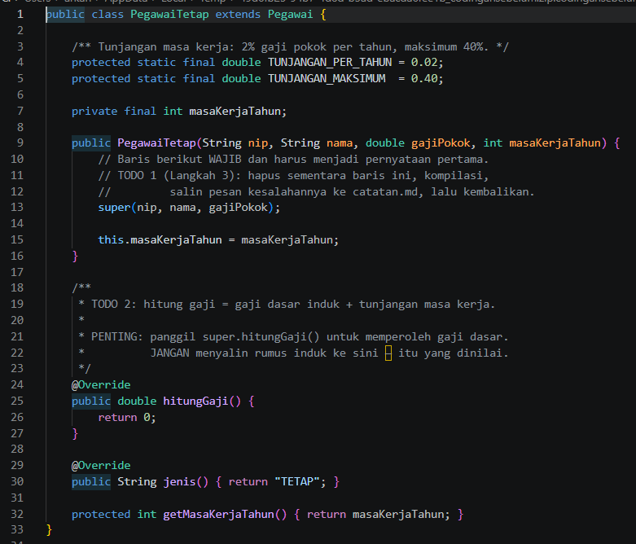</td>
  </tr>
</table>

---

### 1.3. File: `PegawaiKontrak.java`
**Penjelasan Kode:**

`PegawaiKontrak` adalah kelas turunan dari `Pegawai` untuk pegawai berstatus kontrak, dengan atribut dan perhitungan yang khusus bagi pegawai kontrak.

**Bukti Eksekusi (Screenshot):**

<table>
  <tr>
    <th align="center">Before (Kondisi awal / Kesalahan kompilasi)</th>
  </tr>
  <tr>
    <td>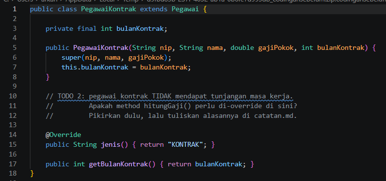</td>
  </tr>
</table>

---

### 1.4. File: `PegawaiHarian.java`
**Penjelasan Kode:**

`PegawaiHarian` adalah kelas turunan dari `Pegawai` untuk pegawai harian, dengan perhitungan yang menyesuaikan jenis kepegawaiannya.

**Bukti Eksekusi (Screenshot):**

<table>
  <tr>
    <th align="center">After (Kondisi akhir / Eksekusi berhasil)</th>
  </tr>
  <tr>
    <td>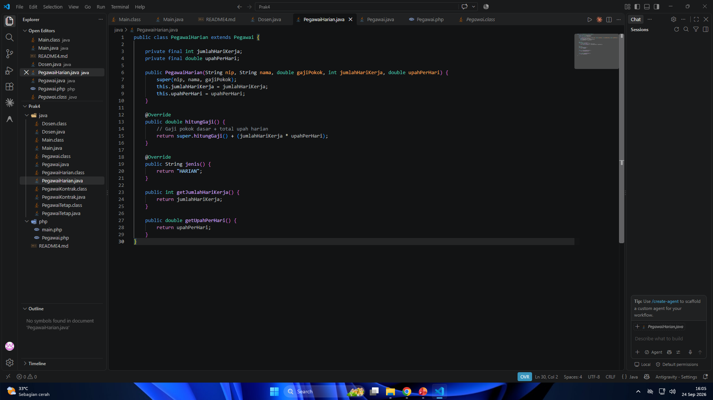</td>
  </tr>
</table>

---

### 1.5. File: `Dosen.java`
**Penjelasan Kode:**

`Dosen` adalah kelas turunan yang mewarisi `Pegawai`, dengan tambahan atribut dan perilaku khusus dosen.

**Bukti Eksekusi (Screenshot):**

<table>
  <tr>
    <th align="center">After (Kondisi akhir / Eksekusi berhasil)</th>
  </tr>
  <tr>
    <td>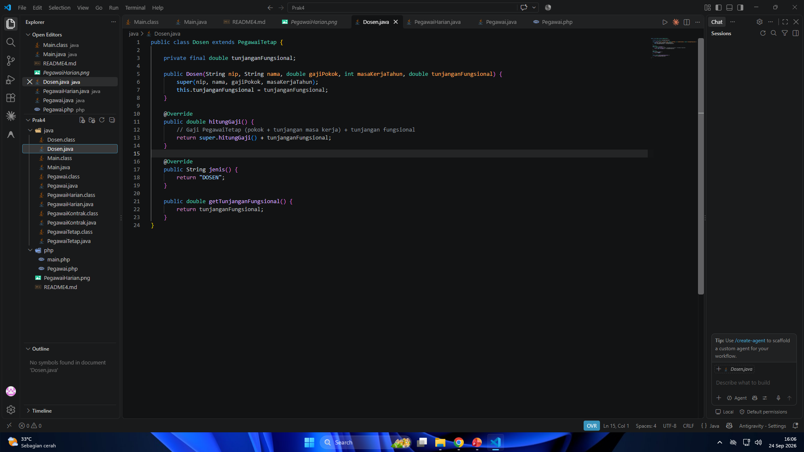</td>
  </tr>
</table>

---

### 1.6. File: `Main.java`
**Penjelasan Kode:**

`Main` adalah program uji yang membuat objek dari kelas-kelas turunan `Pegawai`, lalu menampilkan hasilnya untuk membuktikan pewarisan berjalan: anggota induk dapat dipakai oleh objek turunan, dan method yang di-override menghasilkan perilaku sesuai jenis objeknya.

**Bukti Eksekusi (Screenshot):**

<table>
  <tr>
    <th align="center">Before (Kondisi awal / Kesalahan kompilasi)</th>
    <th align="center">After (Kondisi akhir / Eksekusi berhasil)</th>
  </tr>
  <tr>
    <td>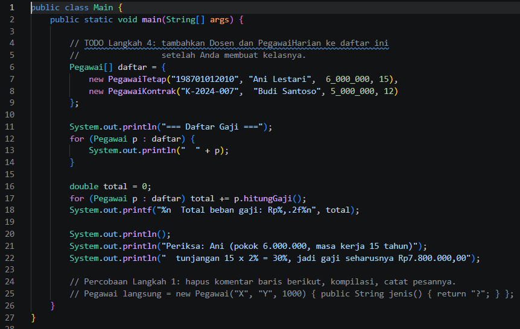</td>
    <td>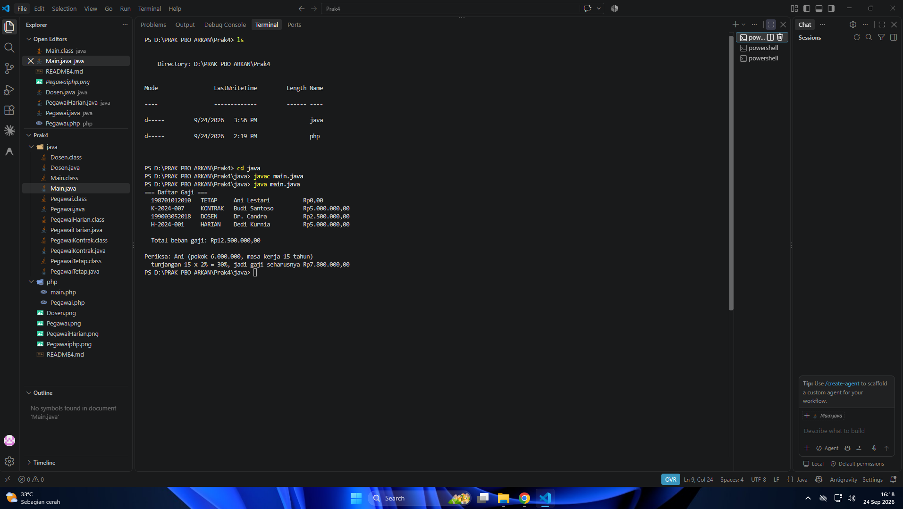</td>
  </tr>
</table>

---

## 2. Implementasi PHP

### 2.1. File: `Pegawai.php`
**Penjelasan Kode:**

Versi PHP dari kelas `Pegawai`. Pewarisan di PHP memakai kata kunci `extends`, dan constructor induk dipanggil dengan `parent::__construct(...)`.

**Bukti Eksekusi (Screenshot):**

<table>
  <tr>
    <th align="center">Before (Kondisi awal / Galat logika)</th>
    <th align="center">After (Kondisi akhir / Eksekusi berhasil)</th>
  </tr>
  <tr>
    <td>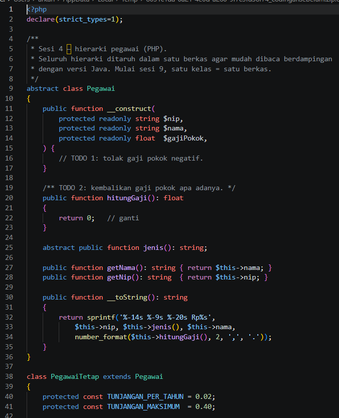</td>
    <td>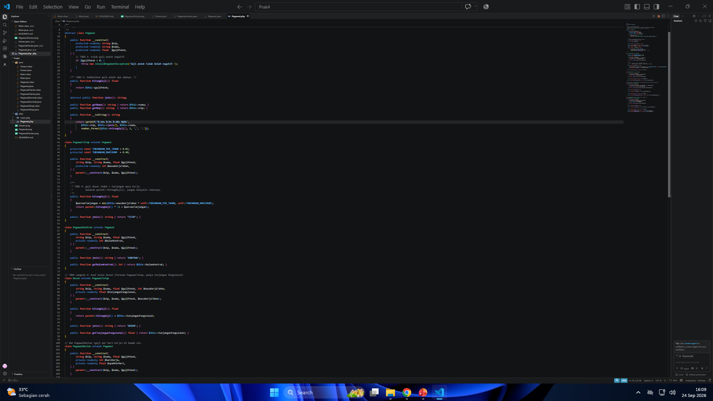</td>
  </tr>
  <tr>
    <td>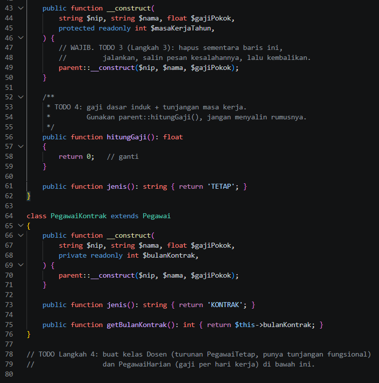</td>
    <td></td>
  </tr>
</table>

---

### 2.2. File: `main.php`
**Penjelasan Kode:**

`main.php` memuat kelas-kelas PHP, membuat objek turunan `Pegawai`, lalu menampilkan hasilnya untuk membuktikan pewarisan berjalan seperti pada versi Java.

**Bukti Eksekusi (Screenshot):**

<table>
  <tr>
    <th align="center">Before (Kondisi awal / Galat logika)</th>
    <th align="center">After (Kondisi akhir / Eksekusi berhasil)</th>
  </tr>
  <tr>
    <td>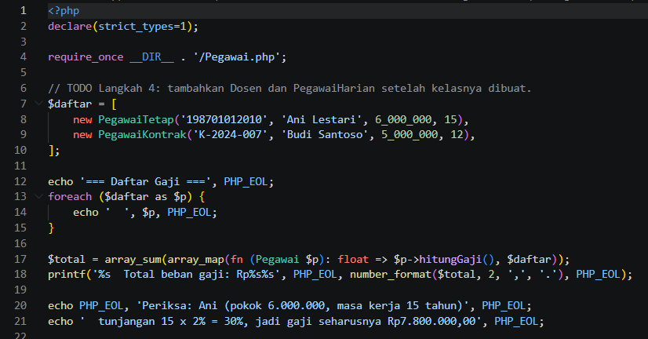</td>
    <td>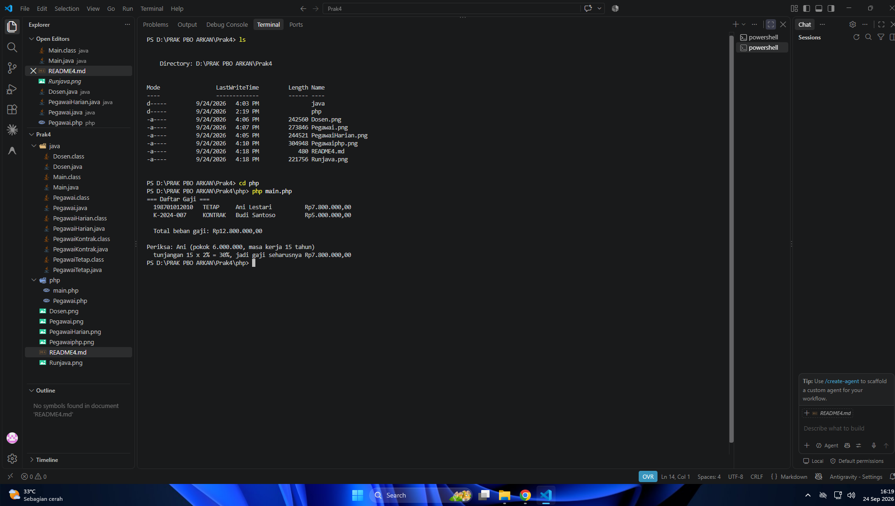</td>
  </tr>
</table>

---

## 3. Kesimpulan

Pewarisan (inheritance) memungkinkan kelas turunan memakai ulang atribut dan method dari kelas induk sehingga kode tidak perlu ditulis berulang. Kelas turunan dapat menambah anggota baru dan mengubah perilaku lewat overriding. Pada Java, pewarisan memakai `extends` dan `super(...)`, sedangkan pada PHP memakai `extends` dan `parent::__construct(...)`.
