# LAPORAN PRAKTIKUM PEMROGRAMAN BERBASIS OBJEK

| Informasi Praktikan | Keterangan |
| :--- | :--- |
| **Nama** | Arkan Abdul Hafizh |
| **NPM** | 4525210137 |
| **Kelas** | A |
| **Mata Kuliah** | Pemrograman Berbasis Objek (PBO) |
| **Pertemuan** | 5 - Polimorfisme |
| **Tanggal** | 01-10-2026 |

---

## 1. Implementasi Java

### 1.1. File: `BangunDatar.java`
**Penjelasan Kode:**

`BangunDatar` adalah kelas induk (abstrak) yang mendefinisikan perilaku umum bangun datar, seperti method untuk menghitung luas dan keliling. Kelas turunan wajib menyediakan implementasinya sendiri (*overriding*).

**Bukti Eksekusi (Screenshot):**

<table>
  <tr>
    <th align="center">Before (Kondisi awal / Kesalahan kompilasi)</th>
    <th align="center">After (Kondisi akhir / Eksekusi berhasil)</th>
  </tr>
  <tr>
    <td>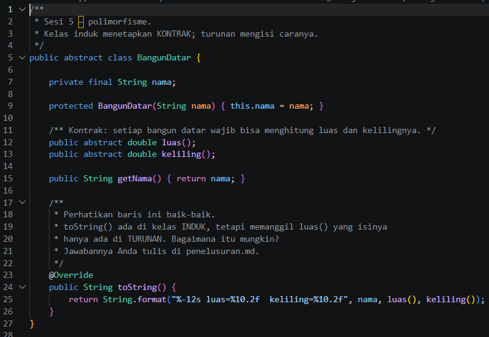</td>
    <td>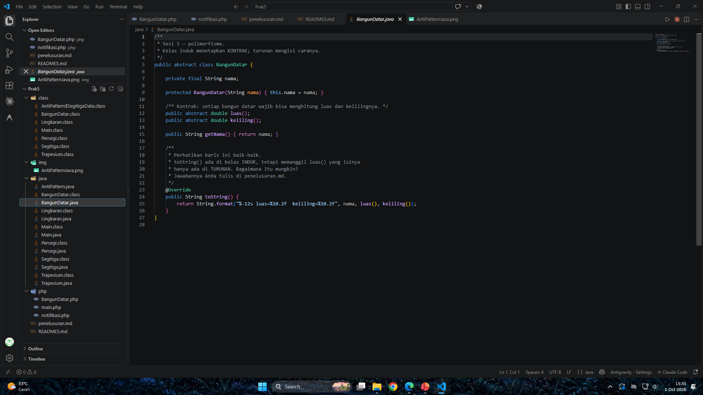</td>
  </tr>
</table>

---

### 1.2. File: `Lingkaran.java`
**Penjelasan Kode:**

`Lingkaran` adalah kelas turunan dari `BangunDatar` yang meng-*override* method luas dan keliling dengan rumus lingkaran.

**Bukti Eksekusi (Screenshot):**

<table>
  <tr>
    <th align="center">Before (Kondisi awal / Kesalahan kompilasi)</th>
    <th align="center">After (Kondisi akhir / Eksekusi berhasil)</th>
  </tr>
  <tr>
    <td>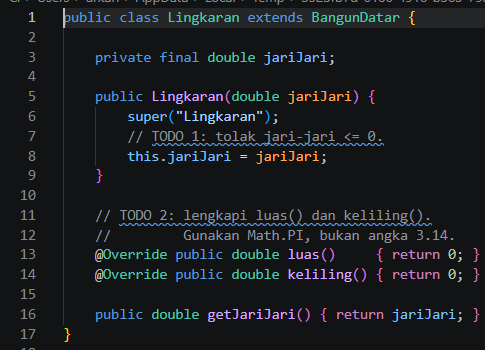</td>
    <td>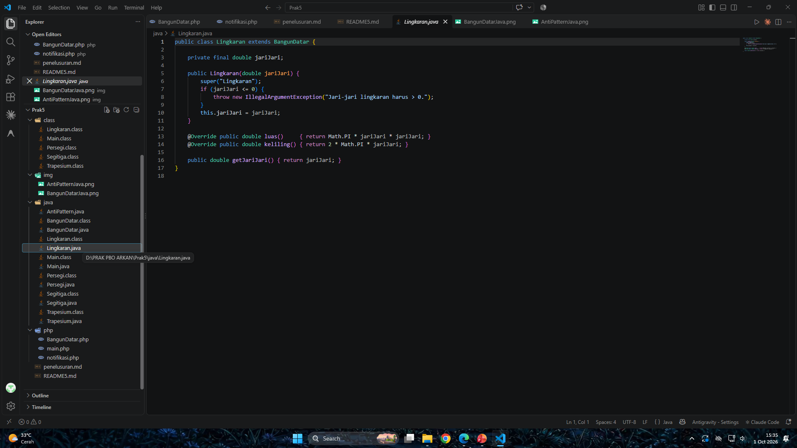</td>
  </tr>
</table>

---

### 1.3. File: `Persegi.java`
**Penjelasan Kode:**

`Persegi` adalah kelas turunan dari `BangunDatar` yang meng-*override* method luas dan keliling dengan rumus persegi.

**Bukti Eksekusi (Screenshot):**

<table>
  <tr>
    <th align="center">Before (Kondisi awal / Kesalahan kompilasi)</th>
    <th align="center">After (Kondisi akhir / Eksekusi berhasil)</th>
  </tr>
  <tr>
    <td>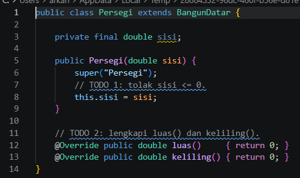</td>
    <td>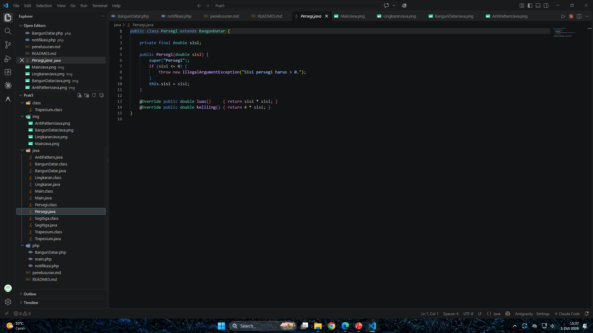</td>
  </tr>
</table>

---

### 1.4. File: `Segitiga.java`
**Penjelasan Kode:**

`Segitiga` adalah kelas turunan dari `BangunDatar` yang meng-*override* method luas dan keliling sesuai rumus segitiga.

**Bukti Eksekusi (Screenshot):**

<table>
  <tr>
    <th align="center">After (Kondisi akhir / Eksekusi berhasil)</th>
  </tr>
  <tr>
    <td>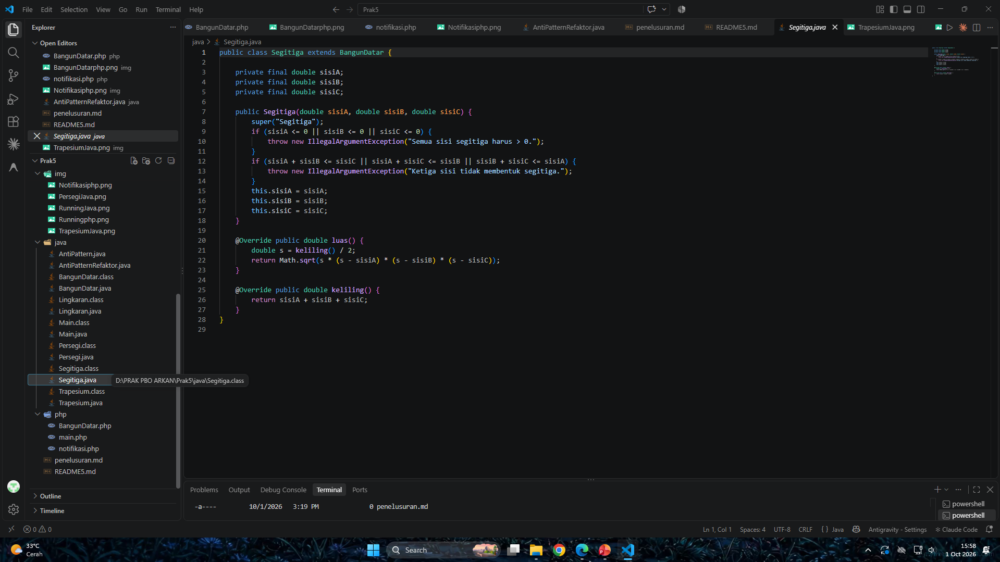</td>
  </tr>
</table>

---

### 1.5. File: `Trapesium.java`
**Penjelasan Kode:**

`Trapesium` adalah kelas turunan dari `BangunDatar` yang meng-*override* method luas dan keliling sesuai rumus trapesium.

**Bukti Eksekusi (Screenshot):**

<table>
  <tr>
    <th align="center">After (Kondisi akhir / Eksekusi berhasil)</th>
  </tr>
  <tr>
    <td>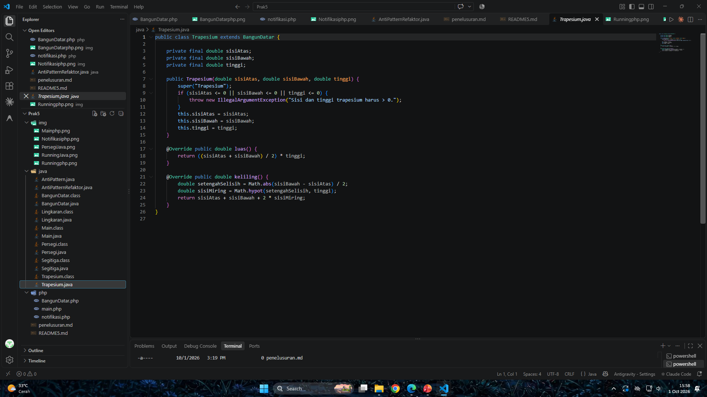</td>
  </tr>
</table>

---

### 1.6. File: `AntiPattern.java`
**Penjelasan Kode:**

Contoh *anti-pattern* yang menangani perbedaan jenis objek dengan percabangan (`if`/`instanceof`/`switch`) sehingga setiap penambahan jenis baru memaksa kode lama diubah. Pendekatan ini bertentangan dengan prinsip polimorfisme.

**Bukti Eksekusi (Screenshot):**

<table>
  <tr>
    <th align="center">Before (Kondisi awal / Kesalahan kompilasi)</th>
    <th align="center">After (Kondisi akhir / Eksekusi berhasil)</th>
  </tr>
  <tr>
    <td>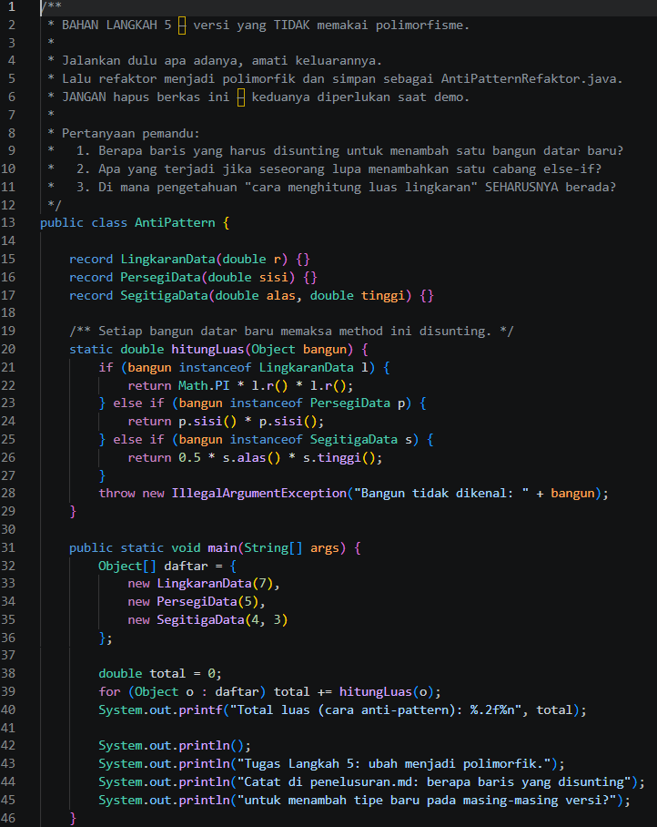</td>
    <td>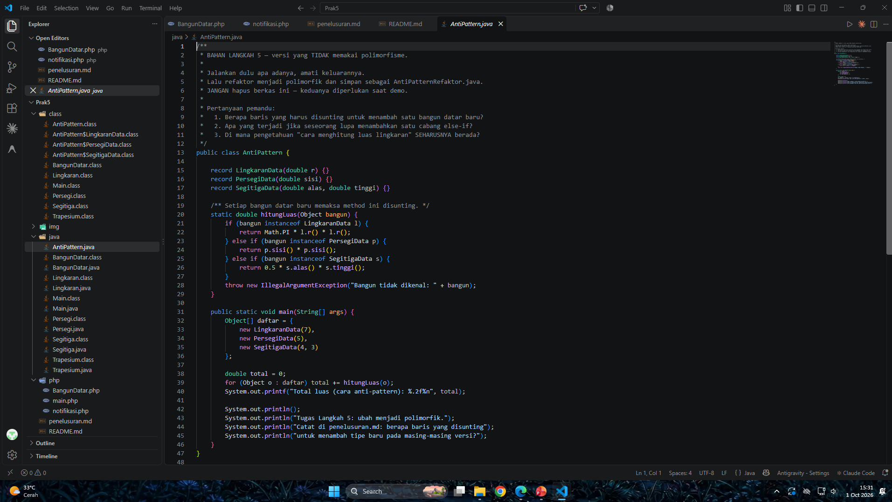</td>
  </tr>
</table>

---

### 1.7. File: Refaktor `AntiPattern`
**Penjelasan Kode:**

Versi refaktor dari `AntiPattern`. Percabangan diganti dengan pemanggilan method polimorfik, sehingga setiap kelas menentukan perilakunya sendiri dan jenis baru dapat ditambahkan tanpa mengubah kode lama.

**Bukti Eksekusi (Screenshot):**

<table>
  <tr>
    <th align="center">After (Kondisi akhir / Eksekusi berhasil)</th>
  </tr>
  <tr>
    <td>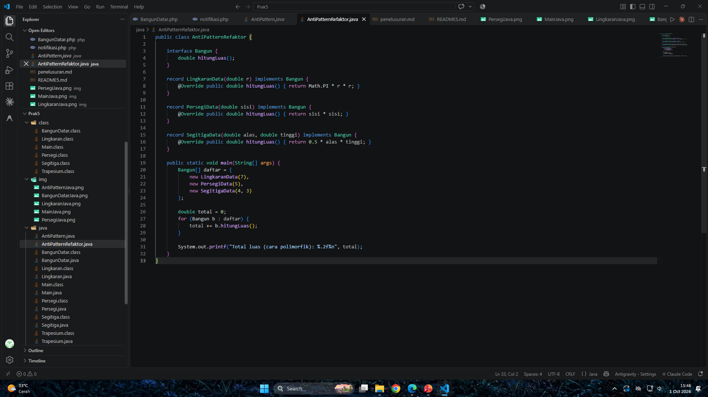</td>
  </tr>
</table>

---

### 1.8. File: `Main.java`
**Penjelasan Kode:**

`Main` adalah program uji yang menyimpan berbagai objek turunan `BangunDatar` lewat referensi tipe induk, lalu memanggil method luas dan keliling. Method yang dijalankan ditentukan oleh jenis objek sebenarnya saat program berjalan (*dynamic dispatch*).

**Bukti Eksekusi (Screenshot):**

<table>
  <tr>
    <th align="center">Before (Kondisi awal / Kesalahan kompilasi)</th>
    <th align="center">After (Kondisi akhir / Eksekusi berhasil)</th>
  </tr>
  <tr>
    <td>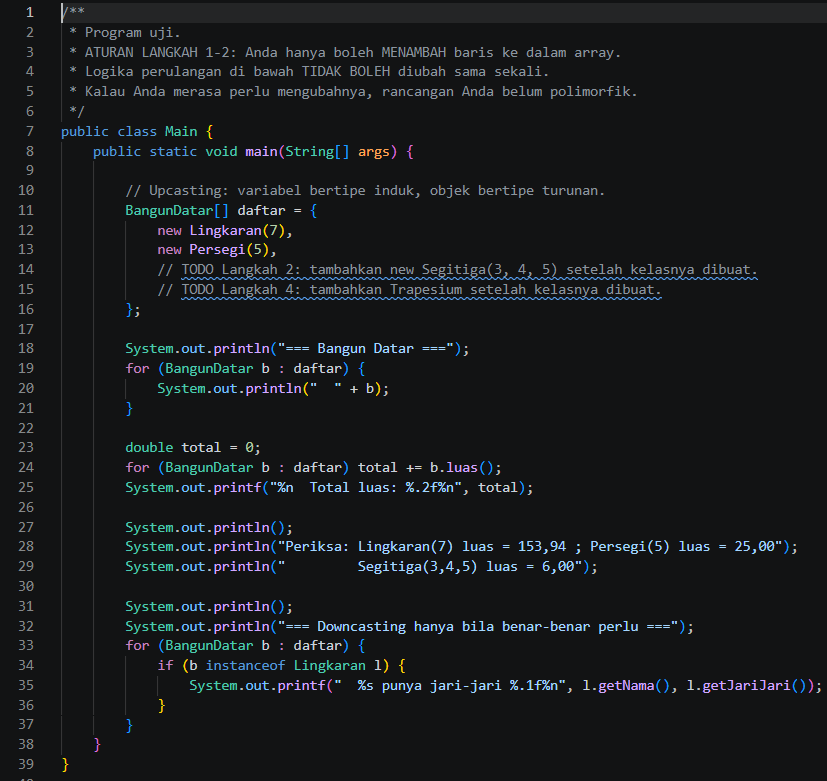</td>
    <td>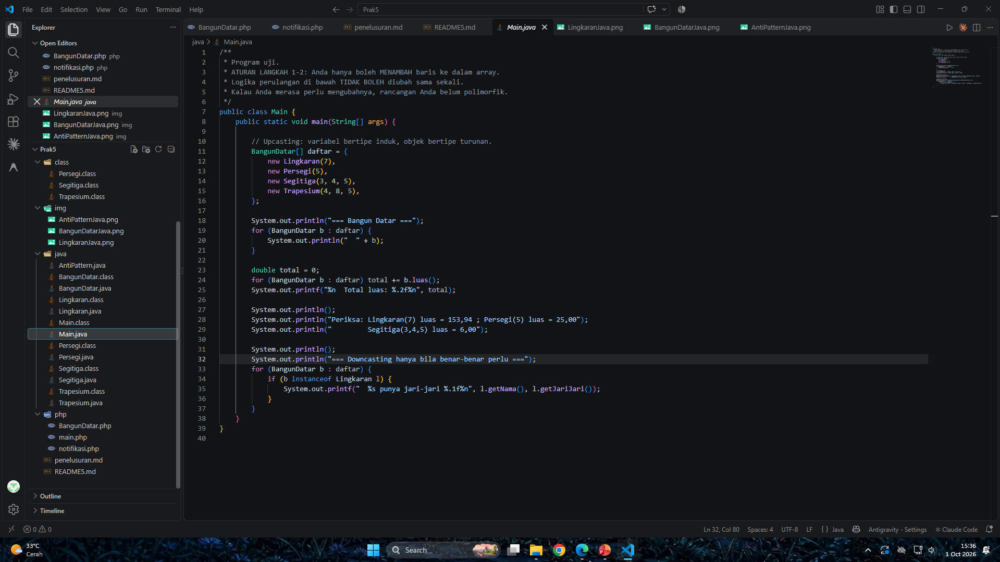</td>
  </tr>
</table>

---

## 2. Implementasi PHP

### 2.1. File: `BangunDatar.php`
**Penjelasan Kode:**

Versi PHP dari kelas `BangunDatar`. Polimorfisme di PHP memakai `extends` dan *overriding* method pada kelas turunan, sehingga pemanggilan method lewat referensi induk menghasilkan perilaku sesuai jenis objeknya.

**Bukti Eksekusi (Screenshot):**

<table>
  <tr>
    <th align="center">Before (Kondisi awal / Galat logika)</th>
    <th align="center">After (Kondisi akhir / Eksekusi berhasil)</th>
  </tr>
  <tr>
    <td>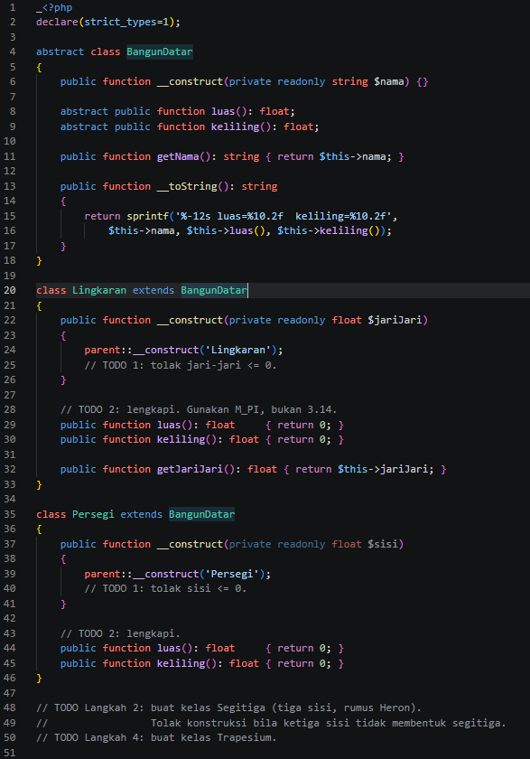</td>
    <td>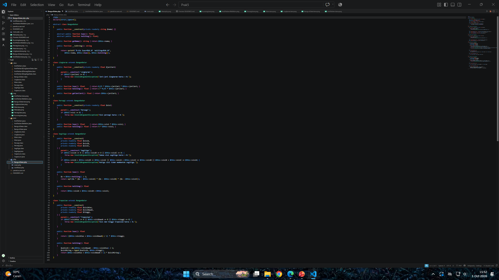</td>
  </tr>
</table>

---

### 2.2. File: `Notifikasi.php`
**Penjelasan Kode:**

Contoh polimorfisme pada sistem notifikasi: setiap jenis notifikasi menyediakan implementasi pengirimannya sendiri, sedangkan pemanggil cukup memakai satu antarmuka yang sama.

**Bukti Eksekusi (Screenshot):**

<table>
  <tr>
    <th align="center">Before (Kondisi awal / Galat logika)</th>
    <th align="center">After (Kondisi akhir / Eksekusi berhasil)</th>
  </tr>
  <tr>
    <td>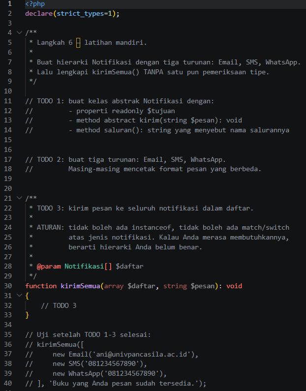</td>
    <td>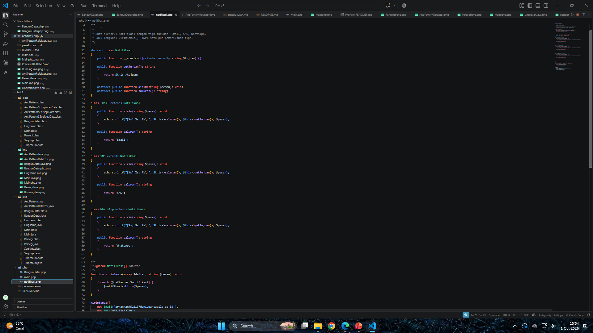</td>
  </tr>
</table>

---

### 2.3. File: `main.php`
**Penjelasan Kode:**

`main.php` memuat kelas-kelas PHP, membuat objek turunan, lalu memanggil method yang sama pada berbagai objek untuk membuktikan polimorfisme berjalan seperti pada versi Java.

**Bukti Eksekusi (Screenshot):**

<table>
  <tr>
    <th align="center">Before (Kondisi awal / Galat logika)</th>
    <th align="center">After (Kondisi akhir / Eksekusi berhasil)</th>
  </tr>
  <tr>
    <td>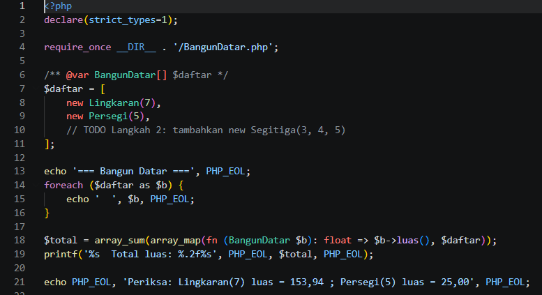</td>
    <td>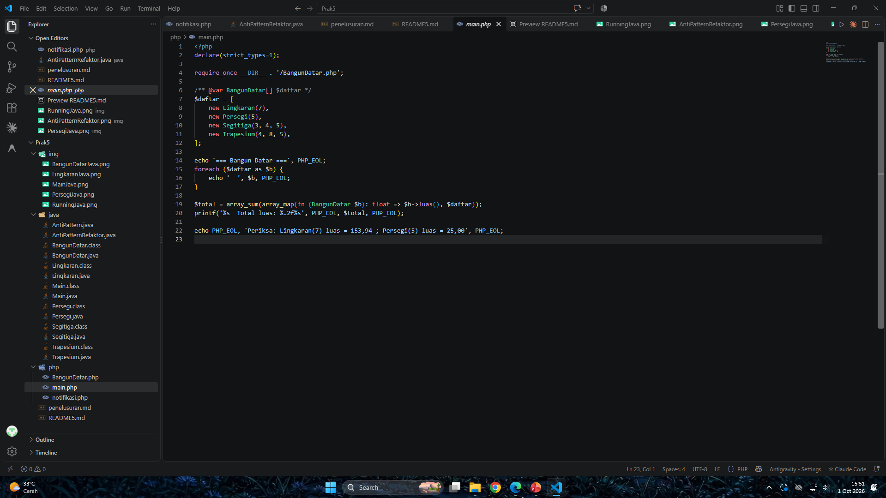</td>
  </tr>
</table>

---

## 3. Hasil Eksekusi Program

Berikut hasil menjalankan program secara keseluruhan di terminal.

### 3.1. Java (`java Main`)

  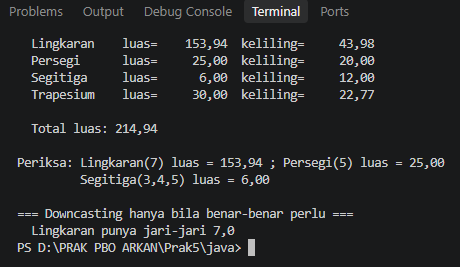

### 3.2. Java - Anti-Pattern

<table>
  <tr>
    <th align="center">Sebelum Refaktor</th>
    <th align="center">Sesudah Refaktor</th>
  </tr>
  <tr>
    <td>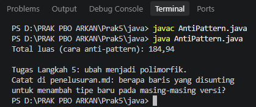</td>
    <td>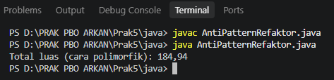</td>
  </tr>
</table>

### 3.3. PHP (`php main.php`)

  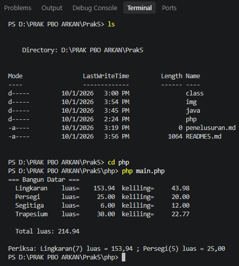

---

## 4. Kesimpulan

Polimorfisme memungkinkan satu antarmuka dipakai untuk berbagai bentuk objek: method yang sama menghasilkan perilaku berbeda sesuai jenis objek sebenarnya melalui *overriding* dan *dynamic dispatch*. Dibandingkan percabangan (`if`/`instanceof`) pada anti-pattern, polimorfisme membuat kode lebih ringkas dan mudah dikembangkan, karena jenis baru cukup ditambahkan sebagai kelas turunan tanpa mengubah kode lama. Konsep ini berlaku di Java maupun PHP, dengan sintaks yang berbeda.