# LAPORAN PRAKTIKUM PEMROGRAMAN BERBASIS OBJEK

| Informasi Praktikan | Keterangan |
| :--- | :--- |
| **Nama** | Arkaan Abdul Hafizh |
| **NPM** | 4525210137 |
| **Kelas** | A |
| **Mata Kuliah** | Pemrograman Berbasis Objek (PBO) |
| **Pertemuan** | 6 - Abstract Class, Interface, Enum, dan Trait |
| **Tanggal** | 08-10-2026 |

---

## 1. Implementasi Java

### 1.1. File: `Kendaraan.java`
**Penjelasan Kode:**

`Kendaraan` adalah *abstract class* yang mendefinisikan struktur dasar dan kerangka umum bagi kendaraan, seperti atribut nama serta method abstrak yang wajib di-*override* oleh kelas turunannya.

**Bukti Eksekusi (Screenshot):**

<table>
  <tr>
    <th align="center">Before (Kondisi awal / Kesalahan kompilasi)</th>
    <th align="center">After (Kondisi akhir / Eksekusi berhasil)</th>
  </tr>
  <tr>
    <td>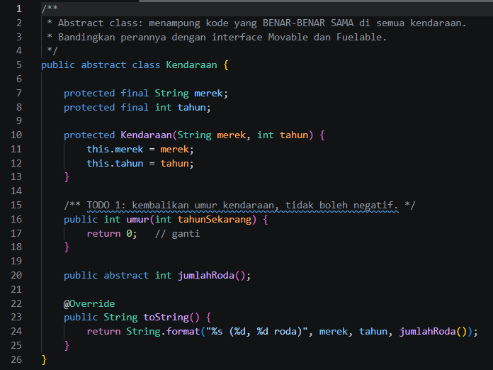</td>
    <td>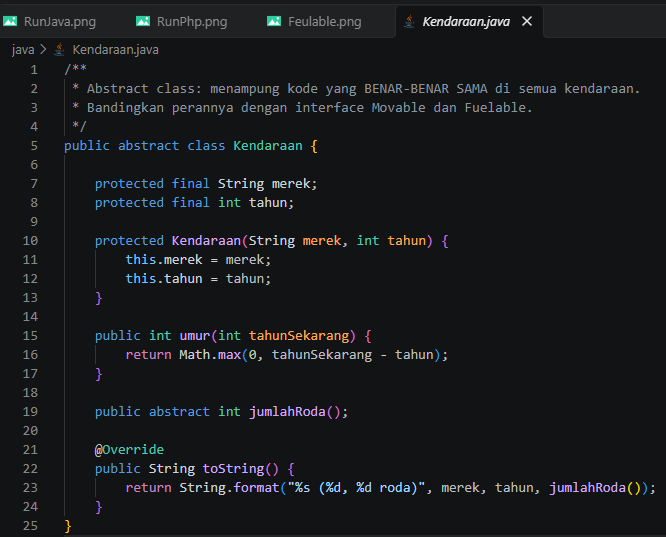</td>
  </tr>
</table>

---

### 1.2. File: `Movable.java`
**Penjelasan Kode:**

`Movable` adalah sebuah *interface* yang menetapkan kontrak perilaku untuk objek yang dapat bergerak, sehingga setiap kelas yang mengimplementasikannya wajib menyediakan logika method `bergerak()`.

**Bukti Eksekusi (Screenshot):**

<table>
  <tr>
    <th align="center">Before (Kondisi awal / Kesalahan kompilasi)</th>
    <th align="center">After (Kondisi akhir / Eksekusi berhasil)</th>
  </tr>
  <tr>
    <td>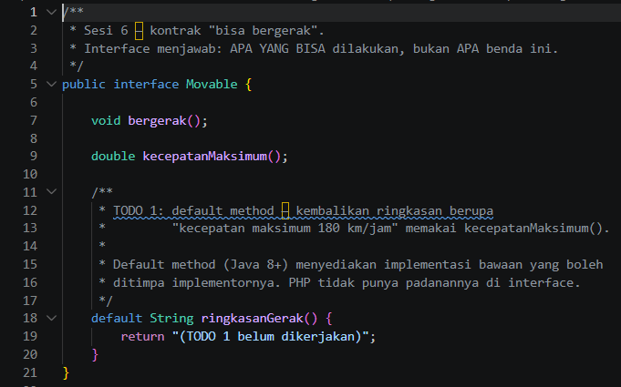</td>
    <td>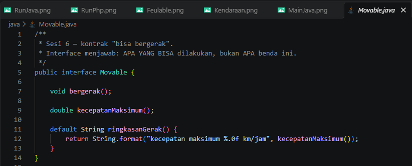</td>
  </tr>
</table>

---

### 1.3. File: `TipeBahanBakar.java`
**Penjelasan Kode:**

`TipeBahanBakar` adalah tipe data *enum* yang mengelompokkan konstanta jenis bahan bakar untuk menjamin keamanan tipe data (*type safety*) dan menghindari penggunaan string bebas.

**Bukti Eksekusi (Screenshot):**

<table>
  <tr>
    <th align="center">Before (Kondisi awal / Kesalahan kompilasi)</th>
    <th align="center">After (Kondisi akhir / Eksekusi berhasil)</th>
  </tr>
  <tr>
    <td>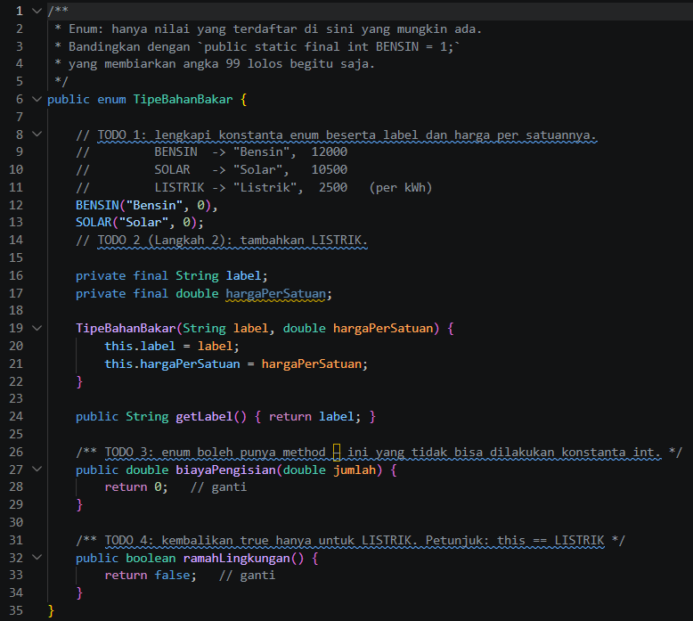</td>
    <td>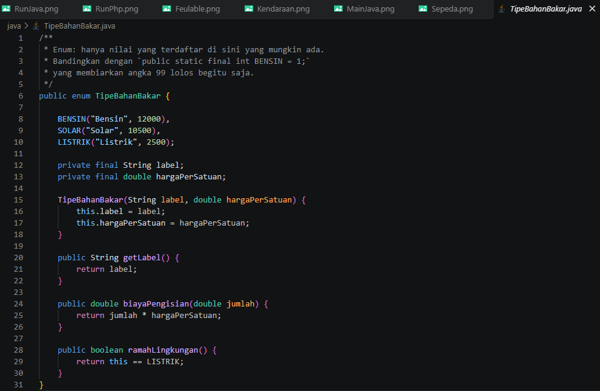</td>
  </tr>
</table>

---

### 1.4. File: `Mobil.java`
**Penjelasan Kode:**

`Mobil` adalah kelas konkret turunan dari `Kendaraan` yang mengimplementasikan *interface* `Movable` dan memanfaatkan *enum* `TipeBahanBakar`. Kelas ini meng-*override* method abstrak dari induk serta interface.

**Bukti Eksekusi (Screenshot):**

<table>
  <tr>
    <th align="center">Before (Kondisi awal / Kesalahan kompilasi)</th>
    <th align="center">After (Kondisi akhir / Eksekusi berhasil)</th>
  </tr>
  <tr>
    <td>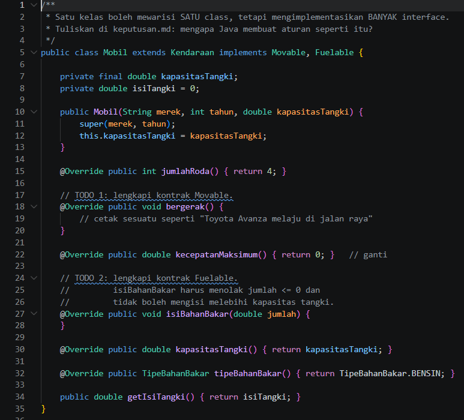</td>
    <td>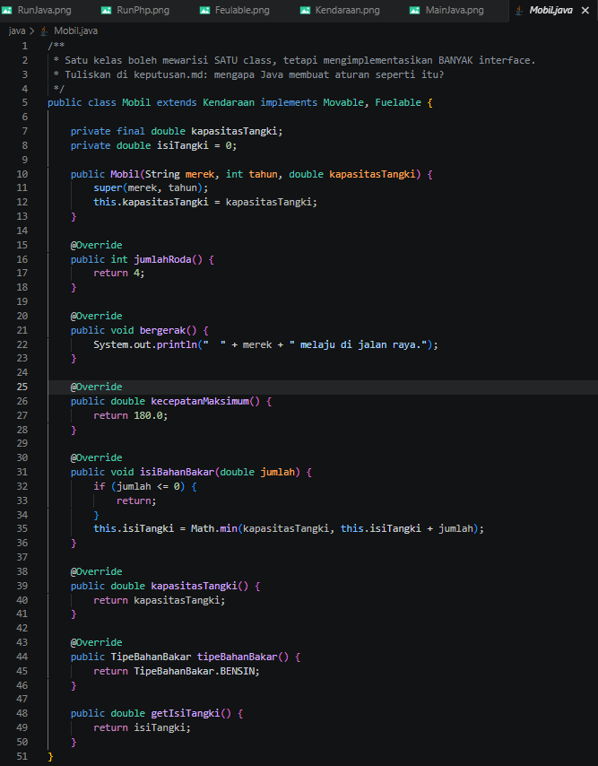</td>
  </tr>
</table>

---

### 1.5. File: `Sepeda.java`
**Penjelasan Kode:**

`Sepeda` adalah kelas turunan dari `Kendaraan` / `Movable` yang merepresentasikan kendaraan non-motorik dengan implementasi method bergerak dan servis sesuai karakteristik sepeda.

**Bukti Eksekusi (Screenshot):**

<table>
  <tr>
    <th align="center">After (Kondisi akhir / Eksekusi berhasil)</th>
  </tr>
  <tr>
    <td>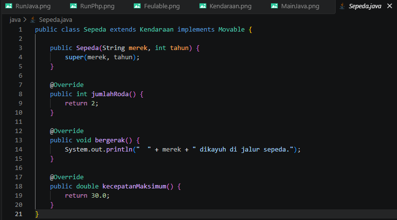</td>
  </tr>
</table>

---

### 1.6. File: `Main.java`
**Penjelasan Kode:**

`Main` adalah program utama untuk menguji interaksi *abstract class*, *interface*, dan *enum* pada Java dengan membuat objek `Mobil` dan `Sepeda` lalu memanggil method-methodnya.

**Bukti Eksekusi (Screenshot):**

<table>
  <tr>
    <th align="center">Before (Kondisi awal / Kesalahan kompilasi)</th>
    <th align="center">After (Kondisi akhir / Eksekusi berhasil)</th>
  </tr>
  <tr>
    <td>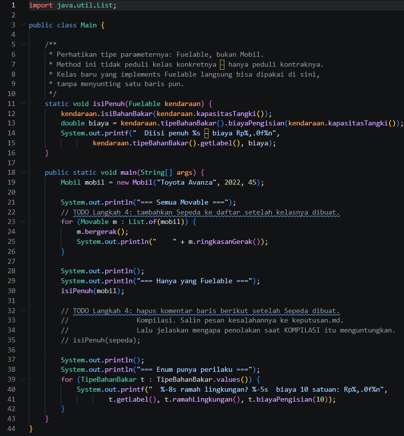</td>
    <td>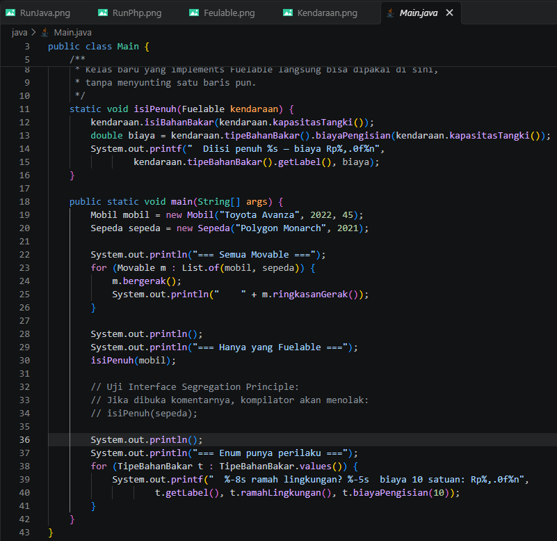</td>
  </tr>
</table>

---

## 2. Implementasi PHP

### 2.1. File: `Abstraksi.php`
**Penjelasan Kode:**

Implementasi *abstract class*, *interface*, dan *trait* di PHP. *Trait* digunakan untuk membagikan method/fitur ke beberapa kelas tanpa memerlukan pewarisan berganda (*multiple inheritance*).

**Bukti Eksekusi (Screenshot):**

<table>
  <tr>
    <th align="center">Before (Kondisi awal / Galat logika)</th>
    <th align="center">After (Kondisi akhir / Lanjutan & Eksekusi berhasil)</th>
  </tr>
  <tr>
    <td align="center">
      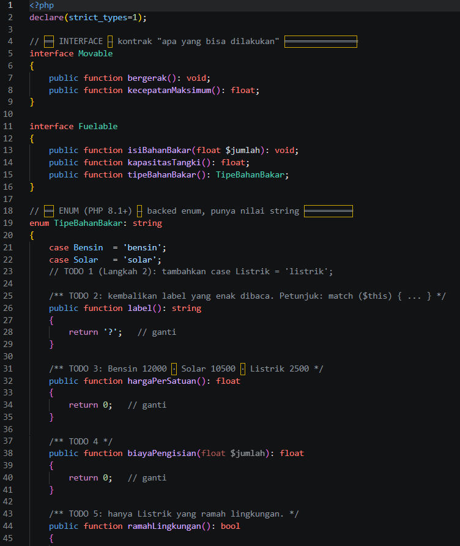  
      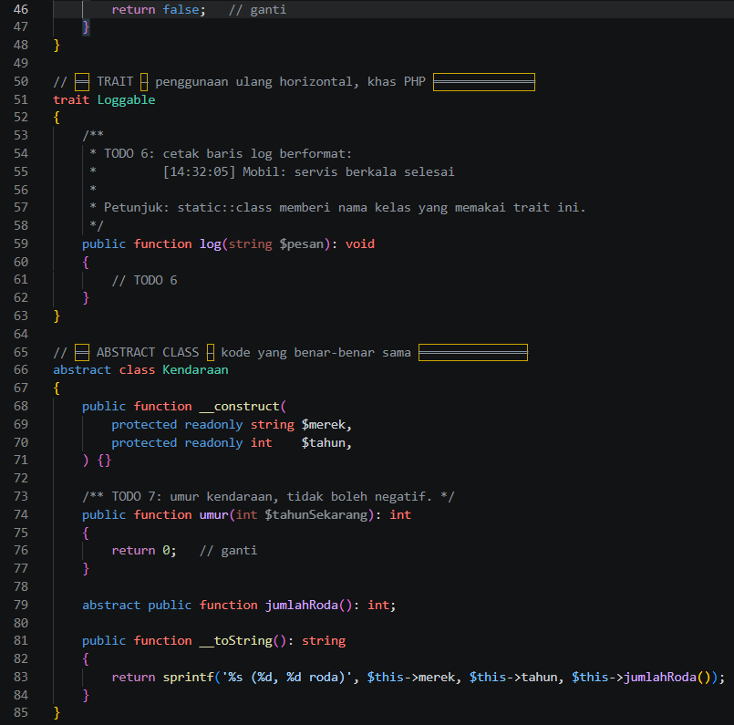  
      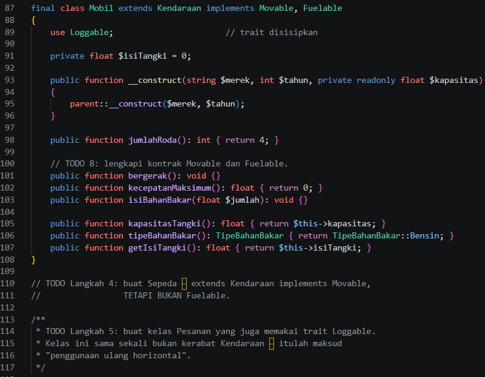
    </td>
    <td align="center" valign="top">
      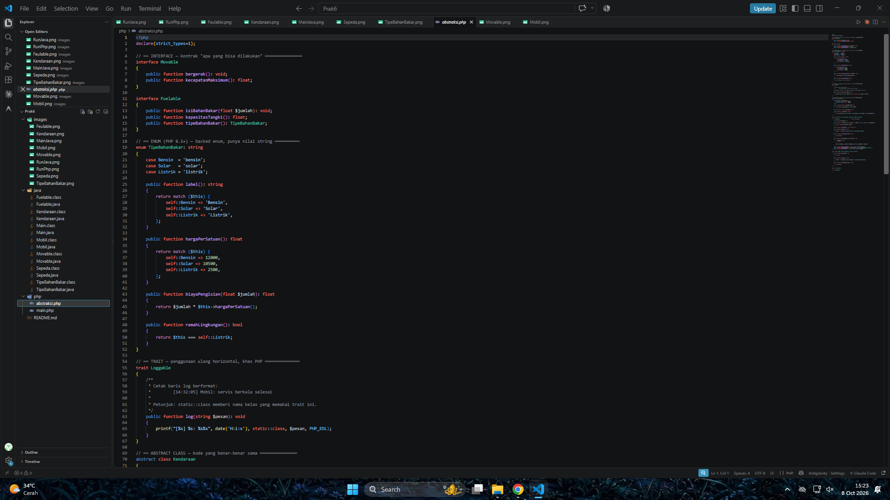
    </td>
  </tr>
</table>

---

### 2.2. File: `main.php`
**Penjelasan Kode:**

`main.php` memuat kelas dan trait dari PHP, membuat objek, serta menjalankan metode-metode polimorfik dan trait untuk menguji abstraksi di lingkungan PHP.

**Bukti Eksekusi (Screenshot):**

<table>
  <tr>
    <th align="center">Before (Kondisi awal / Galat logika)</th>
  </tr>
  <tr>
    <td>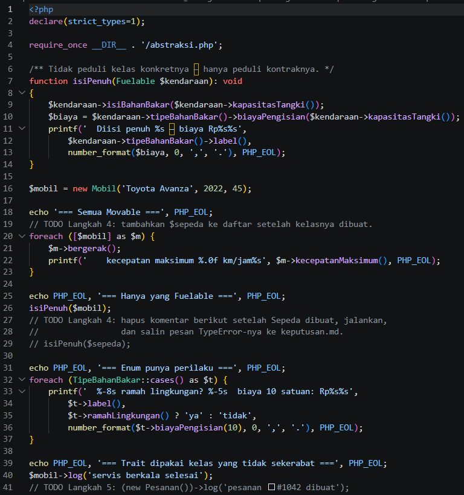</td>
  </tr>
</table>

---

## 3. Hasil Eksekusi Program

Berikut hasil eksekusi program di terminal untuk masing-masing bahasa.

### 3.1. Java (`java Main`)

  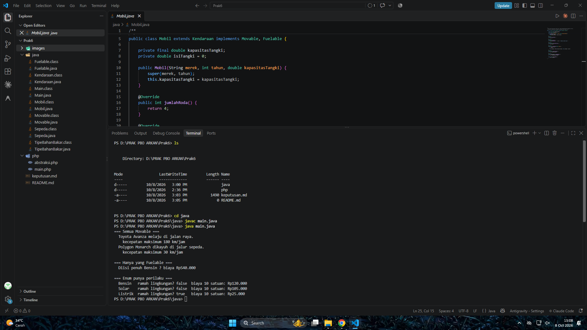

### 3.2. PHP (`php main.php`)

  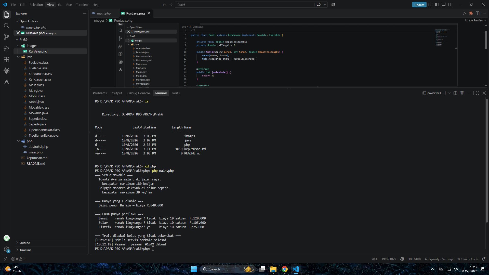

---

## 4. Kesimpulan

Pada praktikum ini, dipelajari empat konsep penting PBO:
1. **Abstract Class**: Menjadi cetak biru (*blueprint*) dengan method abstrak yang wajib diimplementasikan oleh kelas turunan.
2. **Interface**: Menetapkan kontrak perilaku yang harus dipenuhi oleh kelas yang mengimplementasikannya.
3. **Enum**: Mengelompokkan konstanta bernilai tetap untuk menjaga *type safety*.
4. **Trait (PHP)**: Memungkinkan penggunaan kembali kode (*code reuse*) pada beberapa kelas secara fleksibel tanpa keterbatasan *single inheritance*.