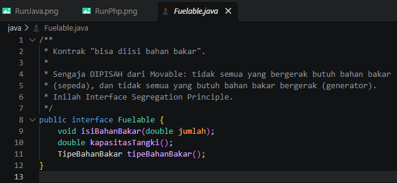

# Laporan Praktikum Sesi 6 — Abstract Class, Interface, Enum, dan Trait

**Nama:** Arkan Abdul Hafizh  
**NPM:** 4525210137  
**Mata Kuliah:** Pemrograman Berorientasi Objek  

---

## A. Deskripsi Praktikum
Praktikum ini membahas penerapan abstraksi pada bahasa pemrograman Java dan PHP melalui empat komponen utama:
1. **Abstract Class:** Digunakan sebagai cetak biru kelas dasar yang memiliki identitas dan properti bersama.
2. **Interface:** Kontrak kemampuan yang memisahkan "apa yang bisa dilakukan" dari entitasnya.
3. **Enum dengan Perilaku:** Pengelompokan nilai konstanta yang dilengkapi dengan logika method.
4. **Trait:** Mekanisme penggunaan ulang kode secara horizontal (*horizontal code reuse*) pada PHP.

---

## B. Dokumentasi Kode Program

### 1. Program Java

#### Movable (`Movable.java`)
Interface kontrak gerak dengan *default method*:


#### Fuelable (`Fuelable.java`)
Interface kontrak pengisian bahan bakar:



#### TipeBahanBakar (`TipeBahanBakar.java`)
Enum bahan bakar beserta method biaya dan status ramah lingkungan:


#### Kendaraan (`Kendaraan.java`)
Abstract class sebagai induk kelas kendaraan:


#### Mobil (`Mobil.java`)
Kelas turunan `Kendaraan` yang mengimplementasikan `Movable` dan `Fuelable`:


#### Sepeda (`Sepeda.java`)
Kelas turunan `Kendaraan` yang hanya mengimplementasikan `Movable`:


#### Main (`Main.java`)
Program utama pengujian Java:


---

### 2. Program PHP

#### Abstraksi (`abstraksi.php`)
Implementasi interface, enum, trait, abstract class, dan kelas konkret di PHP:


---

## C. Hasil Eksekusi Program (Run) & Penjelasan Error

### 1. Hasil Eksekusi Java


### 2. Hasil Eksekusi PHP


---

### 3. Penjelasan Error saat Pengujian Interface Segregation Principle (Langkah 4)

Saat mencoba memanggil fungsi/method `isiPenuh(sepeda)`:

#### Java (Compile-time Error)

Pesan error kompilator:

```text
Main.java: error: incompatible types: Sepeda cannot be converted to Fuelable
        isiPenuh(sepeda);
                 ^